# GitHub Webhook 自动部署配置指南

## 概述

本项目已经集成了 GitHub Webhook 自动部署功能。当你推送代码到 GitHub 后，服务器会自动拉取最新代码并重新部署。

## 功能特性

✅ **自动拉取代码**：从 GitHub 拉取最新代码  
✅ **自动更新依赖**：安装新的依赖包  
✅ **自动清理日志**：清理超过限制的日志文件  
✅ **自动重启服务**：重启应用服务  
✅ **安全验证**：使用密钥验证 webhook 请求  

## 配置步骤

### 1. 配置服务器

#### 1.1 设置 Webhook 密钥

编辑 `.env` 文件，添加 webhook 密钥：

```bash
# 生成一个随机密钥
GITHUB_WEBHOOK_SECRET=$(openssl rand -hex 32)
echo "GITHUB_WEBHOOK_SECRET=$GITHUB_WEBHOOK_SECRET" >> .env
```

或手动设置：

```bash
nano .env
```

添加以下行：

```
GITHUB_WEBHOOK_SECRET=your-secret-key-here
```

#### 1.2 确保服务器可以从外网访问

Webhook 需要能够访问你的服务器。确保：

- 服务器有公网 IP 或域名
- 防火墙允许 HTTP/HTTPS 流量
- 如果使用 Nginx，配置反向代理

#### 1.3 重启服务

```bash
sudo systemctl restart display-date
```

### 2. 配置 GitHub 仓库

#### 2.1 进入仓库设置

1. 打开你的 GitHub 仓库
2. 点击 **Settings**（设置）
3. 点击左侧菜单的 **Webhooks**
4. 点击 **Add webhook**（添加 webhook）

#### 2.2 配置 Webhook

填写以下信息：

- **Payload URL**（载荷 URL）：
  ```
  https://your-domain.com/webhook/github
  ```
  或
  ```
  http://your-server-ip:8000/webhook/github
  ```

- **Content type**（内容类型）：
  选择 `application/json`

- **Secret**（密钥）：
  填入你在 `.env` 文件中设置的 `GITHUB_WEBHOOK_SECRET`

- **Which events would you like to trigger this webhook?**（触发事件）：
  选择 **Just the push event**（仅推送事件）

- **Active**（激活）：
  勾选 ✅

#### 2.3 保存配置

点击 **Add webhook** 按钮保存。

### 3. 测试 Webhook

#### 3.1 测试端点

首先测试 webhook 端点是否可访问：

```bash
curl https://your-domain.com/webhook/test
```

应该返回：

```json
{"message": "Webhook endpoint is working"}
```

#### 3.2 推送代码测试

```bash
git add .
git commit -m "Test webhook"
git push origin master
```

#### 3.3 查看 GitHub Webhook 日志

在 GitHub 仓库的 Webhooks 页面：

1. 点击你刚创建的 webhook
2. 点击 **Recent Deliveries**（最近的推送）
3. 查看请求和响应

成功的响应应该是：

```json
{"message": "Deployment started"}
```

#### 3.4 查看服务器日志

```bash
# 查看应用日志
tail -f logs/display_date.log

# 或查看 systemd 日志
sudo journalctl -u display-date -f
```

你应该能看到类似的日志：

```
2025-12-19 10:30:00 - display_date - INFO - 收到 GitHub webhook 事件: push
2025-12-19 10:30:00 - display_date - INFO - 收到推送: your-username/display_date_python | 分支: refs/heads/master | 推送者: your-username
2025-12-19 10:30:00 - display_date - INFO - 已将部署任务加入后台队列
2025-12-19 10:30:01 - display_date - INFO - 开始执行自动部署...
2025-12-19 10:30:05 - display_date - INFO - 自动部署成功完成
```

## 工作流程

```mermaid
graph LR
    A[推送代码到 GitHub] --> B[GitHub 发送 Webhook]
    B --> C[服务器接收请求]
    C --> D[验证签名]
    D --> E[后台执行部署脚本]
    E --> F[拉取最新代码]
    F --> G[更新依赖]
    G --> H[清理日志]
    H --> I[重启服务]
    I --> J[部署完成]
```



## 手动部署

如果需要手动部署（不通过 webhook）：

```bash
cd /path/to/display_date_python
bash auto_deploy.sh
```

## 安全建议

1. ✅ **使用 HTTPS**：确保 webhook URL 使用 HTTPS
2. ✅ **设置强密钥**：使用长度至少 32 字符的随机密钥
3. ✅ **限制访问**：配置防火墙规则，只允许 GitHub IP 访问
4. ✅ **监控日志**：定期检查日志，发现异常活动

### GitHub IP 地址范围

你可以限制只允许 GitHub 的 IP 地址访问 webhook 端点：

```bash
# 获取 GitHub IP 范围
curl https://api.github.com/meta | jq -r '.hooks[]'
```

## 故障排查

### Webhook 未触发

1. **检查 GitHub 日志**：
   - 进入 GitHub 仓库 Settings > Webhooks
   - 查看 Recent Deliveries 中的错误信息

2. **检查服务器日志**：
   ```bash
   tail -f logs/display_date.log
   ```

3. **测试连接**：
   ```bash
   curl -X POST https://your-domain.com/webhook/github
   ```

### 签名验证失败

- 确保 `.env` 中的 `GITHUB_WEBHOOK_SECRET` 与 GitHub 设置中的密钥一致
- 重启服务使配置生效

### 部署脚本执行失败

1. **检查权限**：
   ```bash
   chmod +x auto_deploy.sh
   ```

2. **手动执行测试**：
   ```bash
   bash auto_deploy.sh
   ```

3. **查看详细日志**：
   ```bash
   bash -x auto_deploy.sh
   ```

### 服务重启失败

- 检查 systemd 服务状态：
  ```bash
  sudo systemctl status display-date
  sudo journalctl -u display-date -n 50
  ```

## 日志说明

### 应用日志

位置：`logs/display_date.log`

包含内容：
- 所有 API 请求
- Webhook 接收记录
- 部署过程日志
- 错误和异常信息

### 日志管理

- 按天分割日志文件
- 自动保留最近 7 天
- 总大小超过 2GB 时自动清理最旧的日志
- 每次部署时执行清理

## 常见问题

### Q: 可以部署指定分支吗？

A: 默认只部署 `master` 和 `main` 分支。如需修改，编辑 `app/routers/webhook.py`：

```python
# 修改这一行
if ref not in ["refs/heads/master", "refs/heads/main", "refs/heads/your-branch"]:
```

### Q: 部署过程中服务会中断吗？

A: 会有短暂的服务中断（通常 2-5 秒），建议在低流量时段部署。

### Q: 如何禁用自动部署？

删除 GitHub 的 webhook 配置，或在 `.env` 中移除 `GITHUB_WEBHOOK_SECRET`。

### Q: 可以部署前运行测试吗？

A: 可以修改 `auto_deploy.sh`，在重启服务前添加测试步骤。

## 更多信息

- [GitHub Webhooks 文档](https://docs.github.com/en/developers/webhooks-and-events/webhooks)
- [FastAPI 后台任务](https://fastapi.tiangolo.com/tutorial/background-tasks/)

---

**配置完成后，你只需要推送代码，服务器就会自动更新！** 🚀
